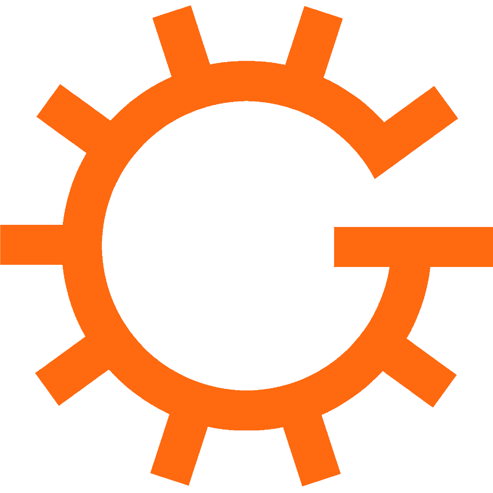

<h1>Gears Engine</h1>

[](https://github.com/RickIsGone/Gears-game-engine/actions/workflows/Windows%20build.yml) [](https://github.com/RickIsGone/Gears-game-engine/actions/workflows/Ubuntu%20build.yml)  

# Building  

> [!IMPORTANT]  
> this project uses C++ modules, which are currently not supported by all compilers and CMake generators, so make sure to use both a compiler and a CMake generator that support modules  

## Prerequisites

* cmake 3.28 or newer
* git

<ins> **1. Cloning the repo:** </ins>  
Start by cloning the repo with `git clone --recursive https://github.com/RickIsGone/Gears-game-engine`

after doing this follow the instruction for the targeted OS

<details><summary><big>WINDOWS</big></summary><p>

  <ins> **2. Downloading the required packages:** </ins>  

  To build the engine you'll need to install the Vulkan SDK, which you can download [here](https://vulkan.lunarg.com/sdk/home#windows)

  <ins> **3. Compiling the project:** </ins>  

  after you are done installing the Vulkan SDK go in the engine root and make a new directory called *build*  

  open a terminal in that directory and type `cmake..`

  if you've compiled the engine using Visual Studio as the cmake generator make sure to move the *shaders* and *assets* directories in the same directory as the executable or the engine wont work  

  congratulation! the engine is now compiled and ready to be used

</details>

<details><summary><big>LINUX</big></summary><p>  

  *the default compiler and CMake generator on linux (gcc and Make) dont support modules so i'll be using Clang and Ninja in the examples below*  

  <ins> **2. Downloading the required packages:** </ins>  

  To build the engine you'll first need to install the required packages, to do so you'll have to paste these lines in the terminal:  

  Debian/Ubuntu based:  

  ```bash
  sudo apt install libwayland-dev libvulkan-dev libxkbcommon-dev xorg-dev
  ```  

  Fedora based:  

  ```bash
  sudo dnf install wayland-devel libxkbcommon-devel libXcursor-devel libXi-devel libXinerama-devel libXrandr-devel vulkan-headers vulkan-loader-devel
  ```
  
  FreeBSD based:  

  ```bash
  pkg install wayland libxkbcommon evdev-proto xorgproto vulkan-headers vulkan-loader
  ```

  after installing the packages you'll need to install glslc to compile the shaders, paste this in the terminal:

  Debian/Ubuntu based: `sudo apt install glslc`

  Fedora based: `sudo dnf install glslc`

  FreeBSD based: `pkg install glslc`

  <ins> **3. Compiling the project:** </ins>  

  after installing glslc open the terminal in the engine root and paste this in the terminal:

  ```bash
  mkdir build
  cd build
  cmake .. -GNinja -DCMAKE_CXX_COMPILER=clang++
  ninja
  ```

  congratulation! the engine is now compiled and ready to be used

</details><p>  

# Libraries

* [GLFW](https://github.com/glfw/glfw)
* [VULKAN](https://www.lunarg.com/vulkan-sdk/)
* [GLM](https://github.com/g-truc/glm/)
* [TINYOBJLOADER](https://github.com/tinyobjloader/tinyobjloader)
* [STB IMAGE](https://github.com/nothings/stb/blob/master/stb_image.h)
